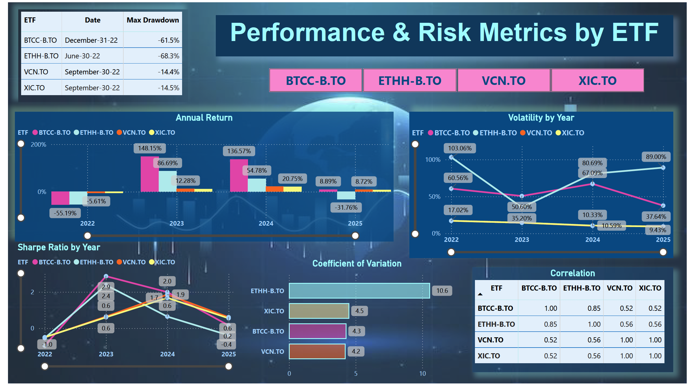
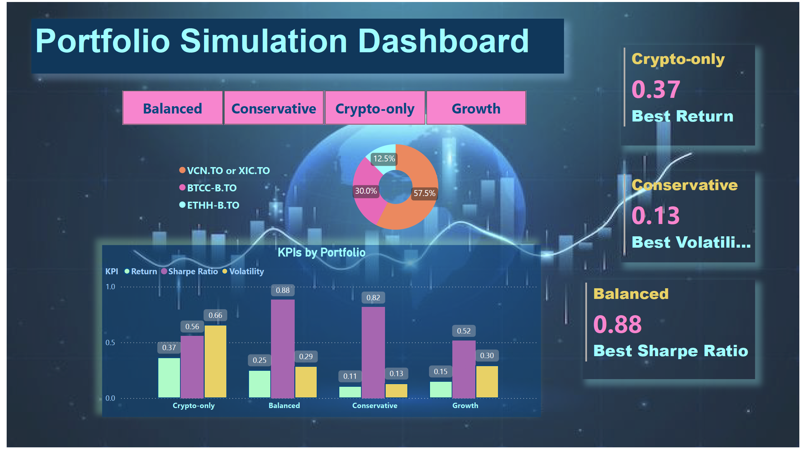

# -Analyzing-Canadian-ETFs-to-Build-Smart-Portfolios
Evaluated 4 ETFs traded in Canada using KPIs like return and risk. Created Power BI dashboard to explore performance and recommend suitable portfolio strategies.

# 📊 ETF Performance Dashboard with Portfolio Insights (Canada)
This project analyzes the historical performance and risk of four investment assets available in the Canadian market: two traditional ETFs (VCN and XIC) and two cryptocurrency ETFs (BTCC and ETHH)using key financial metrics such as return, volatility, Sharpe ratio, and maximum drawdown. The analysis covers a 3-year period and is intended to help investors understand the behaviour of these assets individually and in portfolio combinations.

## 🚀 Tools Used

- **Python** – For initial data preparation and metric calculations
- **Excel** – To organize and export data tables
- **Power BI** – For interactive dashboard creation and visualization

## 📈 ETFs Analyzed

| Ticker       | Description                          |
|--------------|--------------------------------------|
| VCN.TO       | Vanguard FTSE Canada All Cap Index   |
| XIC.TO       | iShares Core S&P/TSX Capped Composite|
| BTCC-B.TO    | Purpose Bitcoin ETF                  |
| ETHH-B.TO    | Purpose Ether ETF                    |

## 📊 Key Metrics

- **Monthly Return**
- **Volatility (Standard Deviation)**
- **Sharpe Ratio**
- **Maximum Drawdown**
- **Coefficient of Variation**
- **Correlation Between ETFs**

Each ETF's performance was compared over a 3-year period. The data was then used to propose four basic portfolio strategies for different investor profiles:

| Portfolio     | Composition                           |
|---------------|---------------------------------------|
| Conservative  | 100% VCN.TO or 100% XIC.TO            |
| Balanced      | 60% VCN.TO, 40% BTCC-B.TO             |
| Growth        | 70% VCN.TO, 30% BTCC-B.TO             |
| Crypto-only   | 50% BTCC-B.TO, 50% ETHH-B.TO          |

## 📊 Dashboard Preview

## 📁 Project Structure
